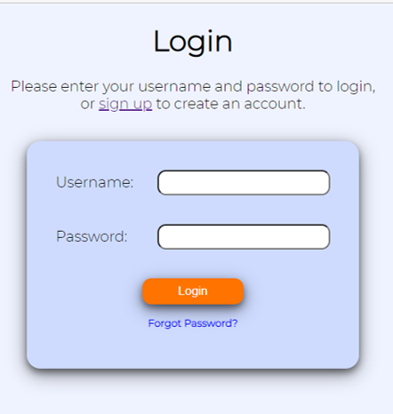
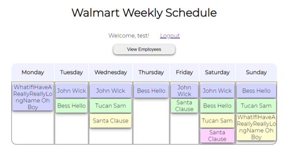
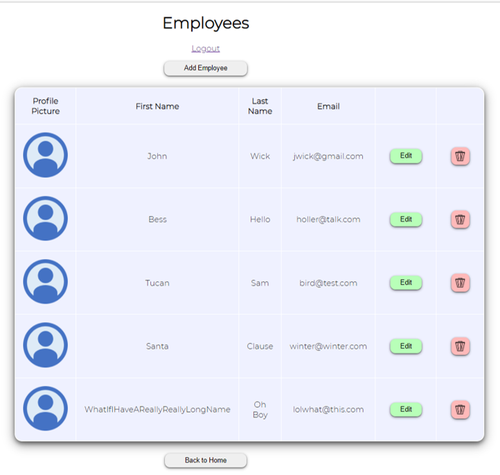
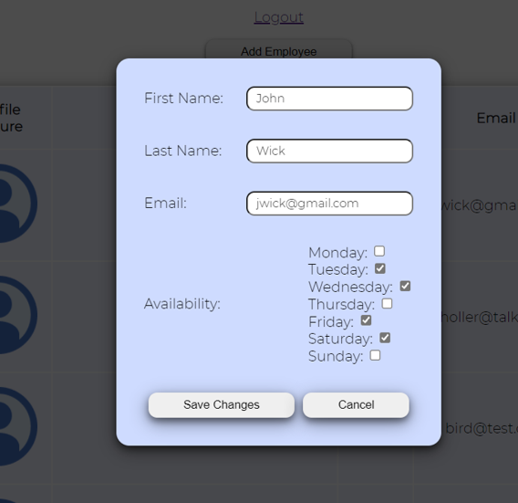

# Welcome to my employee scheduling platform! #
- - - -
## technologies used ##
* Javascript
* HTML
* CSS
* EJS
* Node
* Express
* MongoDB
* Mongoose
* Bcrypt

- - - -
# Screenshots #

Log in screen:

Home page Screen:

Employee view screen:

- - - -
## getting started ##
node server.js
- - - -

# TODO #

* link employees to employers
* allow editing of the schedule

* Add the following properties to the employee model:
    * preferred hours
    * job role
    * age
    * commute time
    * birthday
    * observed holidays
    * most preferred holidays (try to give observed holidays off, placing extra preference on most preferred holidays)
    * who their supervisor is
    * max hours per week
    * probability of being late
    * number of absences
    * number of tardies
    * date hired
    * hours worked (this would be an object with the keys of today, this week, this month, this year, all time)

* Add the following properties to the business model:
    * regular hours
    * when the week starts/ends
    * observed holidays
    * how many employees are usually needed on what days and for which job roles (e.g. maybe a restaurant may need more wait staff during peak hours).
    * What the budget is for employee pay each day